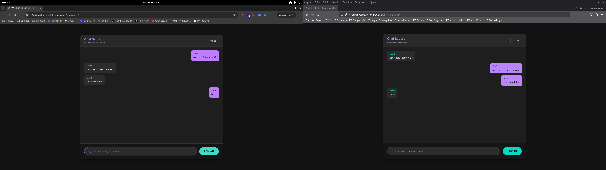

# WhatsChat - Trabalho de Segurança computacional
App de comunicação segura (chat) para exercitar os conceitos de segurança computacional do semestre 2025.2 - UnB.

## Requisitos para execução
+ Orientações assumem (necessário) python e (opcional) um virtualizador de ambientes já instalado na máquina.

#### Ngrok 
+ Disponibilização da aplicação na web para simular conversa entre dois usuários é feita via ngrok, uma ferramenta que expõe localhost para a internet via tunnel ssl. É necessário apenas uma conta gratuita.
+ Para instalação, deve-se consultar a [documentação](https://dashboard.ngrok.com/get-started/setup/linux). Segue um resumo dos passos abaixo:
    + Criar uma conta no [ngrok](https://dashboard.ngrok.com/signup).
    + Instalar via apt
        ```bash
        $ curl -sSL https://ngrok-agent.s3.amazonaws.com/ngrok.asc \
        | sudo tee /etc/apt/trusted.gpg.d/ngrok.asc >/dev/null \
        && echo "deb https://ngrok-agent.s3.amazonaws.com bookworm main" \
        | sudo tee /etc/apt/sources.list.d/ngrok.list \
        && sudo apt update \
        && sudo apt install ngrok
        ```
    + Configurar token de autenticação
        ```bash
        $ ngrok config add-authtoken [seu_token]
        ```
+ É possível não seguir os passos anteriores e somente rodar em localhost **sem** criptografia de tráfego em `http://localhost:5000/`.
+ É possível, também, não seguir os passos anteriores e rodar sem ngrok em localhost **com** criptografia de tráfego em `https://localhost:5000/`. Nesse caso, será necessário comentar a linha `37` e descomentar a linha `39` do `run.py`.

## Passo a passo para execução
1. Crie o virtual environment com qualquer virtualizador de ambiente:
    + Exemplo a seguir com venv do próprio python: `$ python -m venv venv`
2. baixe as bibliotecas e instancie o banco de dados
    ```bash
    $ cd whatschat-flask
    $ pip install -r ./requirements.txt
    $ python run.py
    ```
3. Acessar no browser pelo endereço indicado, no padrão ` https://[codigo].ngrok-free.app`
    + Caso opte pela execução em localhost

## Prévia de uso e telas





## Observações adicionais
+ Certificados autoassinados de exemplo para implementar https criados com o comando abaixo na pasta `assets/certs_example`:
    ```bash
    $ openssl req -x509 -nodes -newkey rsa:4096 -keyout server.key -out server.crt -days 3650 -subj "/C=BR/ST=DF/L=Brasilia/O=CIC_UnB/OU=ChatSeguro/CN=localhost"
    ```
