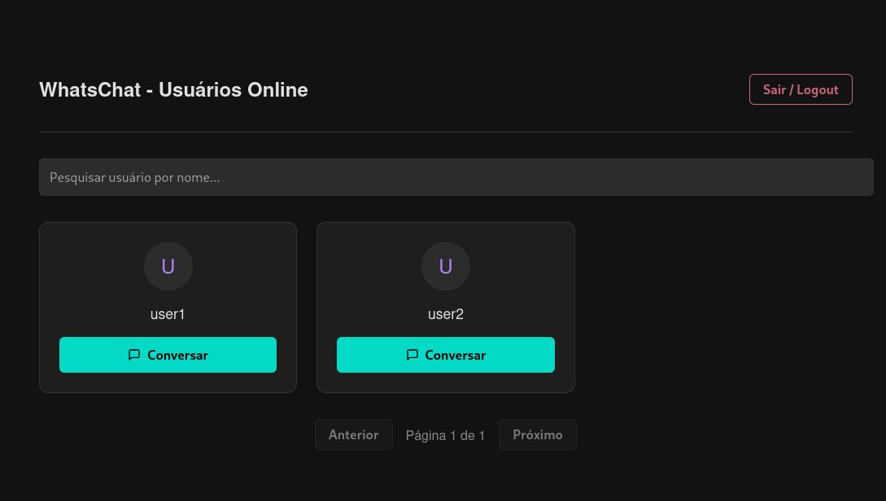

# WhatsChat - Trabalho de Segurança computacional
App de comunicação segura (chat) para exercitar os conceitos de segurança computacional do semestre 2025.2 - UnB.

## Requisitos para execução
+ Orientações assumem (necessário) python e (opcional) um virtualizador de ambientes já instalado na máquina.

## Passo a passo para execução
1. Crie o virtual environment com qualquer virtualizador de ambiente:
    + Exemplo a seguir com venv do próprio python: `$ python -m venv venv`
2. baixe as bibliotecas e instancie o banco de dados
    ```bash
    $ cd whatschat-flask
    $ pip install -r ./requirements.txt
    $ python run.py
    ```

## Prévia de uso e telas




## Observações adicionais
+ Certificados autoassinados de exemplo para implementar https criados com o comando abaixo na pasta `assets/certs_example`:
    ```bash
    $ openssl req -x509 -nodes -newkey rsa:4096 -keyout server.key -out server.crt -days 3650 -subj "/C=BR/ST=DF/L=Brasilia/O=CIC_UnB/OU=ChatSeguro/CN=localhost"
    ```
